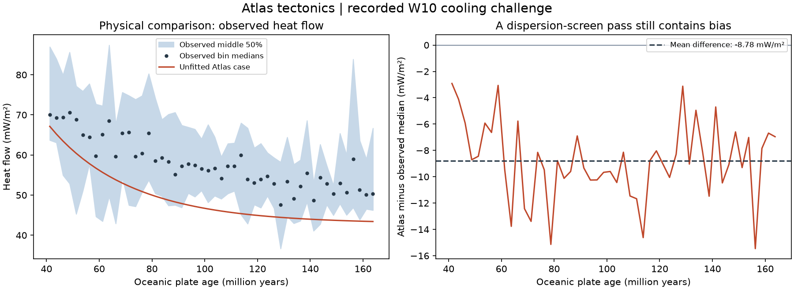
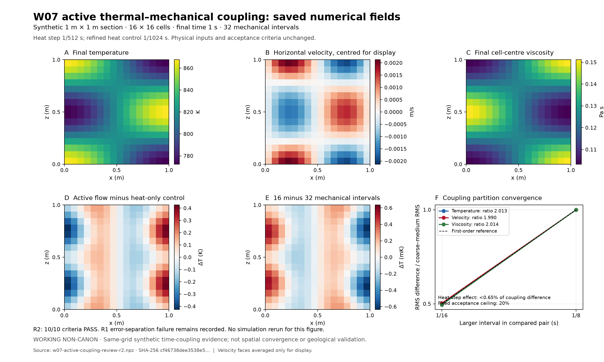

# W10: independent realism challenge and uncertainty

## Comprehensive review, 24 September 2026

This successor inspects all implemented capability families at four levels:
implementation (V1), numerical resolution (V2), physical evidence (V3), and
supported assembly/recovery (V4). It is not the earlier 26-test selection.
Review and authorised correction are complete. The table records the scientific
findings and remaining coverage, not a blanket release decision.

The companion [How Atlas tectonics is made](HOW_TECTONICS_IS_MADE.md) explains
each method's inputs, calculation, outputs and independent checks in plain English.

### Coverage and disposition

| Capability family | V1 and V2: what is checked | V3: physical evidence | V4: usable connection / boundary |
| --- | --- | --- | --- |
| W01 coordinates, plate geometry, boundaries | Rotation invariants, exact areas/volumes, seams/poles, common frames and ownership | PB2002 is a supplied Earth reference; candidate partitions do not establish force-driven plate formation | Static spherical geometry and declared motion; not global spherical evolution |
| W01 geological sampling and motion conversion | Independent intersections, point versus cell means, grid-independent inventories, out-of-section motion refusal | Supplied geological descriptions and motion remain inputs | Supported planar strips and axial wedges initialise W02; arbitrary 3D motion is not silently reduced |
| W02 fixed-grid transport, remap, moving grid and topology | Translation, conservation, positivity, scalar/affine controls, mesh/time refinement; new joint-material regression addresses a real remap/ALE defect | Transport conditional on supplied velocities, not an origin model for those velocities | Cohort identity, boundary/event accounts, cache/worker/restore checks; ordered regional supports |
| W03 cooling and thermal support | Long-series, independent integration/diffusion, depth/time refinement, heat balance, reference/sign checks | Mature-ocean heat-flow screen is partial support, with systematic negative bias | Cooling history and initial geology reconciled; density anomaly is not new conserved mass |
| W03 compaction and column assembly | Fixed grains, loading/unloading memory, continuum integral refinement, finite-fluid accounts | Drained approximation and material coefficients require basin-specific evidence | Stationary fixed-area ordered columns; not transient pore-flow/heat/deformation coupling |
| W04 loads and elastic response | Analytic/quadrature/interface checks, mesh/domain/boundary sensitivity; independent changed-rigidity Fourier oracle added | Field-constrained loads, boundary forcing and effective rigidity unresolved | Supported W03 load routes and dated changing-rigidity equilibria; uniform finite validity is sampled, not a global extrema certificate |
| W05 extension and support | Exact characteristics, thickness/export accounts, independent flexure, domain/cell/output refinement | Fault geometry and motion are supplied; analogue/field challenge not yet bound | Bounded dry listric 1D route and recovery; not predicted fault initiation |
| W06 spreading, histories and inherited margins | Exact event/birth/first-exit controls, cell/depth integrals, heat/material/water accounts and refinement | 50 mature-ocean heat-flow bins; no independent age-depth acceptance or newborn-crust validation | Separate supported scenarios; no automatic W06-to-W07 heterogeneous evolution bridge |
| W07 mechanics, rheology and strength | Manufactured/hydrostatic/rigid/interface controls, spatial refinement, current-law residuals, physical pressure datum | Geological forcing, viscosity and strength calibration unresolved | Explicit homogeneous/steady routes; perfect yielding does not establish a physical shear-band width |
| W07 free surface and thermal feedback | Independent small-wave relaxation; added active same-grid coupling refinement with separately resolved heat error | No finite-amplitude landscape or field-coupling validation | Nonlinear thermal interval API is tested separately from the constant-viscosity assembled workflow |
| W08 shortening, transform and underthrust | Analytic maps, area/centroid balances, continuous-path collision checks, frame/side reversal, finite exports | Prescribed deformation/geometry, not force-predicted natural fault systems | Supported regional regimes and their exact ownership/work accounts |
| W08 subduction | Residuals, velocity-transfer controls, authenticated historical five-case published comparison and refinement | Numerical benchmark, not independent natural-zone observations | Supplied slab geometry/speed; historical campaign is not silently rebound to new source |
| W08 finite magma and joined regimes | Independent calorimetry, component/enthalpy/exhaustion checks, heat/material transfer ownership | Supplied phase/rate/emplacement laws, not spontaneous volcano prediction | Supported regime joins; further geological development belongs to its module |
| Experimental generated dynamics | Constitutive, stress, coupling, solver, timestep, diagnostic and recovery tests | Mature-regime R4.4 comparison held/incomplete | No whole-planet acceptance inferred from short runs or prescribed-motion workflows |
| Retained W09 downstream components | 49 existing methods cover drainage, finite lake water, river erosion and 1D hillslope transport, with analytic/discrete and separate time/space controls | Scenario/field calibration unestablished | Water/river continuation supported; no joined source-to-sink/tectonic-feedback route; hillslope persistent codec deferred. Regression coverage, not expanded tectonics ownership |
| Storage, execution, histories and scale | Source/input identity, lossless parity, corruption/cancellation/refusal, resource controls; added interruption after commit before adoption | Engineering checks are not geological observations | Three supported history routes; current Windows check only, Linux unavailable here; W12 universal assembly not yet delivered |

### Defects and missing checks addressed

**Mixed materials could fabricate relief during regridding.** Three cohorts with
total thickness `[1, 1, 1]` became `[1, 1.025, 0.975, 1]` after refinement, despite
every cohort conserving its inventory. Separate slope limiters did not preserve
the scalar total. The authorised correction jointly constrains material slopes,
retains nonnegative reconstructed values, and performs both moving-grid time
stages using all cohorts together. It does not renormalise completed inventories.
Reference/native implementations, worker memory reservations and method/cache
identities are updated together. The corrected integrated route passes all 137
selected checks below, including eight new remap/ALE regression methods.

**Active coupling needed its own convergence experiment.** A nearly stationary
conduction check cannot establish moving temperature → viscosity → velocity
feedback. The new 16×16 synthetic test uses 8/16/32 mechanical intervals at a
common heat timestep. Its first run correctly failed: heat discretisation error
was too large to isolate the coupling error. Reducing only the heat timestep by
16, with unchanged physics and gates, passed all ten criteria. Differences in
temperature, velocity and viscosity fall by approximately two per refinement;
heat-step effects are below 0.65% of the coupling differences, versus a 20% limit.
This is same-grid time-splitting evidence, not a spatial/continuum or field oracle.

**Two other missing independent controls now exist.** Changing-rigidity support
is compared with an independently integrated Fourier series for piecewise loads,
using two absolute equilibria. All three generic history routes are interrupted
after a snapshot commits but before the live runner adopts it. Recovery must
restore without recalculation or duplicate work/energy, then compute only the
one remaining output. These regressions are retained in `test_validation_gaps.py`.

### Evidence, inspection and timing

| Run | Result | Measured duration |
| --- | --- | ---: |
| [Original comprehensive baseline](../evidence/comprehensive-baseline-r1.json) | 3,565 tests; 2 failures, 6 error records, 11 skips; source unchanged | 1,729.674 s (28 min 49.674 s) |
| [Corrected W01/W02/W05 integration and new flexure/recovery controls](../evidence/remap-v2-integration-r1.json) | 137/137 pass, no skips; source unchanged | 124.359 s including loading the selection; unittest body 123.441 s |
| Reference-policy test repair | 45/45 pass; source/test/report/policy inventory unchanged | 7.135 s |
| Four Windows fixture modules | 174 collected; 172 pass, 2 explicit symlink-privilege skips; no errors/failures | 10.310 s |
| [Public active-coupling diagnostic, corrected source](../evidence/w07-active-coupling-r3.json) | 10/10 gates pass; all work reservations released | 71.364 s |
| [Combined resource drill](../evidence/comprehensive-resource-r1.json) | All 3 configurations pass; identical outputs, five warm cycles each | 20.391 s summed monitored case duration |
| Required source-safety checks | 13 maps/41 paths; 30 tests pass, 1 environmental symlink skip | 0.124 s test body |

The full baseline ran once before the approved correction. It is retained as
**failed/incomplete**, not relabelled as a passing full post-fix run. All observed
non-environmental failures have targeted passing successors. Eleven existing
symlink skips and the two newly explicit symlink skips remain unavailable on this
Windows account; the verifier's zero-skip acceptance policy was not weakened.
Linux/WSL is not installed here, so no current Linux pass is claimed.

The six baseline error records came from five tests: fixture SQLite connections
left open on Windows, two unavailable symlink fixtures, and an implicit cp1252
document read. Fixtures now close connections deterministically, separate the
unrelated-database assertion from the privilege-dependent link check, and read
UTF-8 explicitly. No production storage or privilege settings were changed.

The two plate-reference failures assumed exact cross-runtime replay of a historical
report and a particular diagnostic sampling phase. MS's non-simple retraced boundary
has a near-180-degree turning branch sensitive to round-off. Qualification is now
checked against the same execution's raw report, exactly; a separate test replays
the actual historical nonphysical value and proves it remains unclipped. MS stays
excluded at every phase. No observations, historical bytes, policy or threshold
were changed. The [completion receipt](../evidence/comprehensive-review-r1.json)
binds the focused repairs and retained logs.

The independent changed-rigidity oracle has maximum displacement discrepancies
1.451e-11 and 2.154e-11 m against its unchanged 1e-7 m limit. Post-commit recovery
restores each of the three routes with zero physical producer calls, computes the
single missing output once, and makes zero calls for the final warm retrieval.

The approved `psutil` 7.2.2 installation supplies process measurements separately
from numerical work accounting. Serial/auto/process configurations peak at
224,096,256 / 226,697,216 / 390,520,832 bytes of sampled process-tree RSS, respectively;
accounted peaks are 71,860,288 / 74,760,288 / 282,679,360 bytes within their declared
96 / 96 / 384 MiB allowances. RSS can double-count shared pages and miss short peaks;
USS is recorded separately and PSS is unavailable on this platform.

### Cost of the numerical correction

[Three-cohort, 256-cell complete-call measurements](../evidence/remap-v2-timing-r1.json)
use one warm-up and three measured calls per route. Ambient host activity was not
controlled; these are descriptive measurements, not a reliable speedup forecast.

| Route | Old median | Corrected median | Observed time change |
| --- | ---: | ---: | ---: |
| Reference remap | 3.5436 ms | 5.9205 ms | +2.3769 ms / +67.08% |
| Reference moving-grid update | 1.6598 ms | 5.8514 ms | +4.1916 ms / +252.54% |
| Native remap | 0.3703 ms | 0.3371 ms | −0.0332 ms / −8.97%; no reliable gain inferred |
| Native moving-grid update | 0.2569 ms | 0.5622 ms | +0.3053 ms / +118.84% |

The price buys the missing total-consistency constraint. Maximum scalar-total
discrepancy falls from 0.00637453 to 2.22e-16 for remap, and from 0.00121725 to
4.44e-16 for moving-grid transport, while individual inventories and nonnegative
fields remain valid. This is an accuracy correction, not a claimed optimisation.

### Output inspection and remaining boundaries

Existing geometry/reference visuals were regenerated and inspected: formation-age
labels, the PB2002 boundary inventory and six globe views. The actual saved
active-coupling fields and heat-flow residuals were also inspected. Those inspections
check units, axes, field meaning and visible patterns, not geological realism.
All 50 heat-flow predictions are below their observational medians; the retained
mean bias is −8.782888 mW/m². The plotted interquartile spread is not a confidence
interval. No model parameters were fitted to conceal the discrepancy.





The coupling figure was made from R2 saved fields; the final public R3 field
archive is byte-identical (SHA-256 `cf46738dee3538e509d2317137b574ae8d33cc06c5354b0603db2968a04c0eca`).
The earlier failed coarse-heat diagnostic is retained in the completion receipt,
not erased by the successful resolution refinement.

Outstanding physical/assembly issues remain explicit in the table. The uniform
finite-region flexure validity margin needs an extremum bound or demonstrated
refinement margin before certifying a near-limit application. R4.4 is still held,
and no long campaign, field-data invention, downstream expansion or production
release is part of this pass.

### Original bounded assessment (historical snapshot)

The following is the earlier source-bound r1 result, retained rather than repinned.
Its source-dependent receipts are not evidence for changed remap/ALE source.

Implemented assessment, 24 September 2026. WORKING NON-CANON.
Production physics, parameters, source budget and campaign holds are unchanged.

## Result and use

[Original assessment](../evidence/w10-assessment-r1.json): `ASSESSMENT_COMPLETE`.
All 26 selected implementation checks pass, no skips, with unchanged source bytes.
The unchanged synthetic oceanic cooling parameters also pass the predeclared
observational **dispersion screen**. This is a bounded physical consistency result,
not a calibrated confidence statement or blanket acceptance of tectonic dynamics.

Run from the repository root with the existing scientific environment:

```text
python -I -B tectonics/tools/check_w10.py --report tectonics/evidence/w10-assessment-NEW.json
```

An existing report is never overwritten. `python -I -B tectonics/verify.py --w10`
emits the same assessment to stdout. Required dependencies are the committed
surface report, history report, retained subduction reports and local observation
fixture; no downloading, fitting, plotting or broad discovery occurs at runtime.
Stale required evidence refuses rather than silently rerunning or repinning it.
Regenerate only the affected bounded evidence when its source/runtime changes.

## Independent observational challenge

The [fixture](../cases/w10_ocean_heatflow_r1.json) contains every one of the 50
published 2.5 Ma bins whose centres lie between 40 and 165 Ma in the global
heat-flow inventory of Richards et al. (2018). It preserves all seven original
numeric columns, source/archive SHA-256, attribution and the CC BY 4.0 licence.
No fitted `model_outputs` were imported. The interval and screen were declared
before evaluating Atlas, and no bins were removed because Atlas disagreed.

The frozen W06 case supplies surface/base temperatures 273.15/1573.15 K,
100 km plate thickness, diffusivity 1e-6 m2/s and conductivity 3.3 W/(m K).
Both W06 input files and their unchanged parameters are checked, not recalibrated.
Although the methods paper was previously consulted during development, these
observations were not used to fit this synthetic case. This is not a blind
external validation exercise.

Production `finite_plate_temperature` is evaluated at each age; positive outward
heat flow is derived with a second-order one-sided surface derivative. Depth
steps 10, 5 and 2.5 m must give a finest change below 1e-8 W/m2. A separate test
compares this derivative against the independently written constant-plate series.
The plate equation is not replaced by a second implementation for observations.

The fixed statistic is RMS of `(prediction - median)/(IQR/1.349)`, with a
descriptive consistency threshold of 1. The conversion follows equation 17 of
the paper; **the threshold is an Atlas screening decision**, not a published
acceptance criterion, statistical significance test or standard error of a mean.
Bins receive equal weight; sample counts, quartiles and every residual remain
available in the report. Dispersion can conceal systematic error, so signed bias
and quartile coverage are reported alongside the screen.

| Quantity | Unchanged baseline result |
| --- | ---: |
| Scaled RMS, threshold 1 | 0.7145870852 |
| RMS discrepancy | 9.251998 mW/m2 |
| Mean signed discrepancy | -8.782888 mW/m2 |
| Predictions inside observed interquartile range | 24/50 (48%) |
| Largest change from 5 m to 2.5 m derivative | 1.58808e-10 W/m2 |

The negative bias is retained, not corrected away. Eight fixed one-at-a-time
sensitivities vary conductivity, diffusivity, thickness and temperature contrast
by +/-20%. Lower conductivity, lower temperature contrast and greater thickness
fail the same screen (scaled RMS 1.45858, 1.45858 and 1.00103). All variants and
their full curves are retained; none is selected as a replacement baseline.
Conductivity/diffusivity changes imply the corresponding change to volumetric
heat capacity. These scenarios are not a posterior or calibrated uncertainty.

Using younger/older bin edges gives scaled RMS 0.70347/0.72566. This is sensitivity
to bin location, not an age uncertainty distribution. Sediment correction,
hydrothermal effects, spatial sampling and correlation limit interpretation;
their uncertainty is not quantified by this screen. It does not validate newborn
ocean cooling, independent age-depth behaviour or arbitrary planetary conditions.

## Numerical coverage and honest evidence reuse

The exact [26-method profile](../cases/w10_tectonics_r1.json) has no all-tests
fallback. It covers T01 rotation, T02 frames/traces, T03 translation/extension,
T04 birth/migration/retirement, T05 heat/conduction, T06 compaction accounts,
T07 elastic support, T08 regional mechanics, T09 strength/surface conservation,
T10 shortening/shear/underthrust, T11 retained subduction comparisons, T14 joined
accounts and T15 source refusal/recovery. Manufactured conduction, flexure and
mechanics tests include refinement; they are not geological observations.

T09 additionally has a fresh [B09 surface convergence run](../evidence/w10-free-surface-r1.json):
12 checks, ten trajectories, Q2 grids 4x2/8x4/16x8, 16/32/64 steps and both frozen
small amplitudes. Finest maximum amplitude errors are 0.00368764%/0.00368756%;
time-difference ratios are 4.11201/4.11201. Its independent finite-depth BVP oracle,
resource gates, frozen design/case and all current production/driver hashes pass.
The old surface record was not reused as current after relevant code changed.

Step 4's three-route recovery evidence is reused only because its complete
production, helper/fixture and runtime bindings still match. No accepted physical
outputs are replayed just for reassurance. The five-case subduction acceptance
and adapter/report hashes are checked, but those campaigns are labelled historical:
recorded source differences are listed, not hidden behind their passing numbers.
Later documented parity checks support limited retention, not a claim that every
historical runtime/input is identical to today's checkout. No new full subduction
campaign or R4.4 run was performed.

The report stores one complete source inventory and only actual before/after
differences, avoiding duplicated inventories. Failed, skipped, missing, stale or
numerically unresolved required evidence cannot count as assessment completion.
A completed physical comparison that disagrees with observations is a legitimate
negative assessment, never converted into a passing physical claim.

## Decisions and remaining physical evidence

| Envelope | W10 disposition |
| --- | --- |
| Constant-property oceanic cooling, 40-165 Ma | Consistent with this observed heat-flow dispersion; systematic underprediction retained |
| Rigid/prescribed motion and supported deformation accounts | Selected analytic/manufactured implementation checks pass; this is numerical verification |
| Extension, collision/underthrust and fault behaviour | Independent analogue/field deformation and forcing validation unresolved; supplied geometry does not predict fault initiation |
| Regional rheology and elastic support | Field-constrained strength, viscosity, boundary forcing and effective elastic thickness remain unresolved |
| Subduction temperatures | Authenticated historical published numerical comparison, not new field validation |
| Generated plate dynamics | R4.4 held/incomplete; no acceptance inferred from prescribed motion |

T16 now has the explicitly limited observational heat-flow comparison above;
it does not close all withheld-geological tests. T12 incision/diffusion and T13
sediment/lake routing remain with their downstream owners, per the module boundary
decision. W09's unfinished downstream work is not silently included in tectonics.

Next is W11 performance and scale within supported envelopes. W12 assembly must
retain these distinctions and cannot turn unresolved field evidence into release
acceptance. No whole-world, production-ready or calibrated-uncertainty flag is set.

## Time, resources and focused verification

- Selected 26 checks: 11.764664 s; complete W10 assessment: 12.119292 s.
- Separate fresh B09 run: 16.393214 s, peak accounted 21,349,888 bytes under
  128 MiB, zero outstanding reservations and zero refusals.
- Observation baseline plus eight sensitivities and two age-edge curves:
  0.005779 s within the assessment, peak kernel accounting 90,288 bytes under
  its 16 MiB allowance. This is not total process memory/RSS.
- Four new observation tests pass in 0.011 s; five new selection/status/receipt
  tests pass in 0.921 s. No broad regression or long campaign was added.
- Required safety checks pass: 13 source maps/41 paths; 31 safety tests in
  0.110 s (30 passed, one existing environmental skip). Changed tracked files
  pass `git diff --check`.
- Reused recovery evidence originally took 20.380206 s to produce. That workload
  was avoided here; it is not a measured new solver speedup or percentage saving.

These measurements are from Windows and the existing Python 3.12.14,
NumPy 2.4.6 / SciPy 1.17.1 environment. No new Linux execution is claimed.
The production package remains 124/128 source files; no numerical laws changed.

## Papers and existing software consulted

- [Richards, Hoggard, Cowton and White (2018), JGR](https://freddrichards.github.io/documents/papers/richards_etal_2018_jgr.pdf),
  *Reassessing the Thermal Structure of Oceanic Lithosphere With Revised Global
  Inventories of Basement Depths and Heat Flow Measurements*, doi:10.1029/2018JB015998.
  Section 2.2, Figure 3c and equation 17 inform selection, data limitations and the
  dispersion statistic. [Cambridge deposited observations](https://www.repository.cam.ac.uk/items/76c2dd6c-0ea4-4886-9c48-f52f81561fa9),
  doi:10.17863/CAM.26215, CC BY 4.0, supply the actual external comparison.
- [ASPECT benchmark documentation](https://aspect-documentation.readthedocs.io/en/v3.0.0/user/benchmarks/):
  code verification versus physical validation, and using analytic/published
  benchmarks for the former. No ASPECT execution or numerical output imported.
- [FEniCS-SZ](https://github.com/cianwilson/fenics-sz) and its
  [subduction benchmark notebook](https://cianwilson.github.io/fenics-sz/notebooks/03_sz_problems/3.4b_sz_benchmark.html):
  declared sample quantities, refinement and cross-code comparison practice.
  Its newer geometry/sample definitions are not substituted into the older
  Atlas reference case. No third-party solver installation or code copied.
